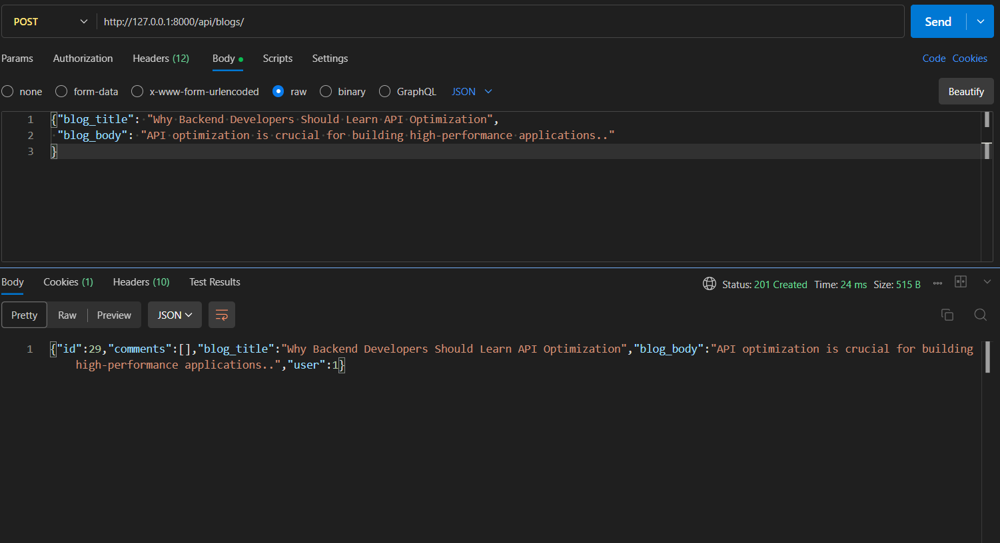
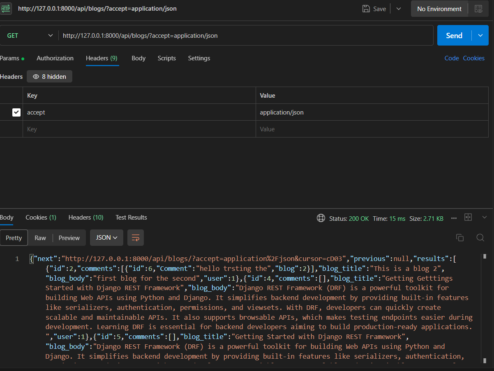
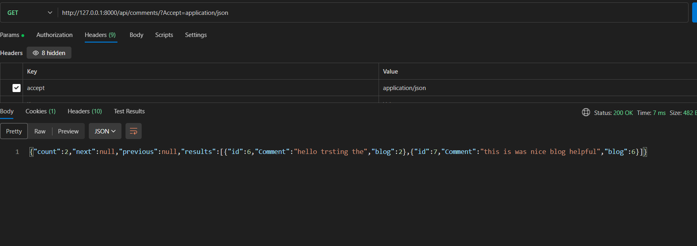

# 🚀 DRF Blog Platform

A production-ready REST API built using Django REST Framework.
This project demonstrates authentication, role-based permissions, caching, filtering, and scalable API design.

---

## 🔥 Features

* 🔐 JWT Authentication (Login & Refresh)
* 👤 Role-based access (Author / Reader / Admin)
* 📝 Blog & Comment system
* 🔍 Filtering, Search, Ordering
* 📄 Pagination (Cursor & LimitOffset)
* ⚡ Caching for performance optimization
* 🧩 Multi-app architecture (blogs, employees, accounts, student)

---

## 🛠️ Tech Stack

* Python
* Django
* Django REST Framework
* SQLite
* SimpleJWT
* django-filter

---

## 📂 Project Structure

```text
api_project/
│
├── accounts/      # user profiles & roles
├── blogs/         # blog & comment system
├── employees/     # employee APIs
├── student/       # student APIs
├── myrproject/    # main settings
├── manage.py
└── .gitignore
```

---

## 🔗 API Endpoints

### 🔐 Authentication

* `POST /token/`
* `POST /token/refresh/`

### 📝 Blogs

* `GET /api/blogs/`
* `POST /api/blogs/`
* `GET /api/blogs/{id}/`
* `PUT /api/blogs/{id}/`
* `DELETE /api/blogs/{id}/`

### 💬 Comments

* `GET /api/blogs/comments/`
* `POST /api/blogs/comments/`

---

## ⚡ Caching

* Implemented using Django cache framework
* Reduces database hits for blog listing
* Improves API performance

---

## 🔐 Permissions

* **Admin** → full access
* **Author** → create/update/delete own blogs
* **Reader** → read-only access

---
## 📸 API Screenshots

### 🔐 JWT Login
![Login] (JWTllokenloogin.png)
 
### 🔄 Token Refresh


### 📝 Create Blog


### 📄 Blog List


### 🔍 Search / Filter
![Search] (images\filter.png)

### 💬 Comments API

## ⚙️ Setup Instructions

```bash
git clone https://github.com/triveni-gavathe/django-rest-blog-api.git
cd drf-blog-platform

python -m venv env
env\Scripts\activate

pip install -r requirements.txt
python manage.py migrate
python manage.py runserver
```

---

## 📌 Future Improvements

* Add Redis caching
* Add API rate limiting
* Deploy on cloud (Render / AWS)
* Add frontend (React)

---

## 👨‍💻 Author

Triveni Ravindra Gavathe
